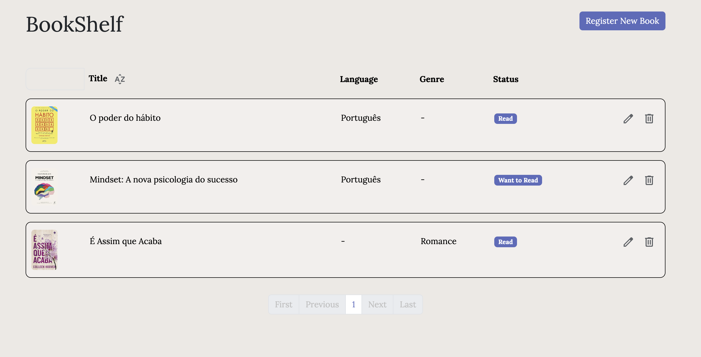

# 📚 Bookshelf

Bookshelf is a CRUD application for managing a book collection. The project consists of a backend developed in Spring Boot and a frontend developed in Angular.
- Backend ⟶ Java, Spring Boot, JPA/Hibernate, MySQL
- Frontend ⟶ Angular, TypeScript, HTML5, SCSS
 

## Features
- Add a new book
- List all books
- Update book information
- Delete a book from the collection

 

## How to Run
Backend

1. Clone the repository: `git clone https://github.com/leticiaschneider/Bookshelf.git`
2. Navigate to the frontend directory: `cd backend-springboot`
3. Configure the MySQL database:
- Create a database named bookshelf.
- Update the application.properties file with your database settings.
4. Compile and run the application: `mvn spring-boot:run`

 

Frontend
1. Navigate to the frontend directory: `cd frontend-angular`
2. Install dependencies: `npm install`
3. Run the app: `ng serve`

Visit `http://localhost:8080/` in your browser to see the app in action.

&nbsp;
## ✨ Contact

Letícia Araújo Schneider - @leehschneider - leticia.schneider@gmail.com
